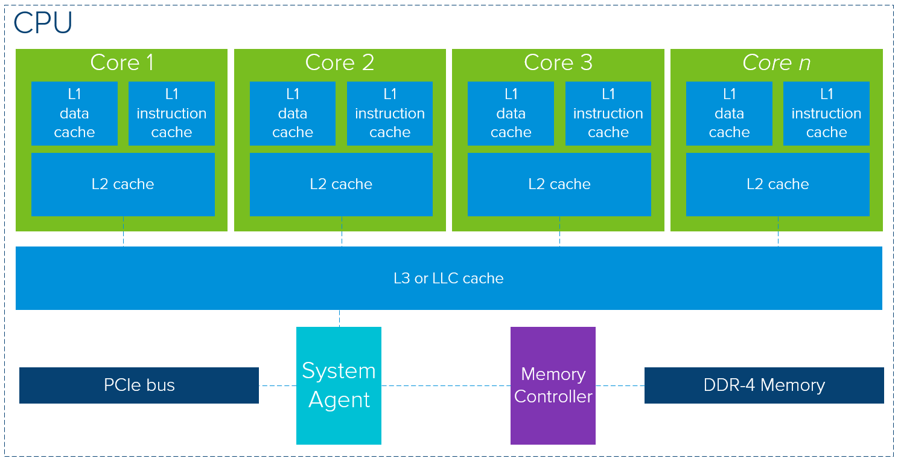
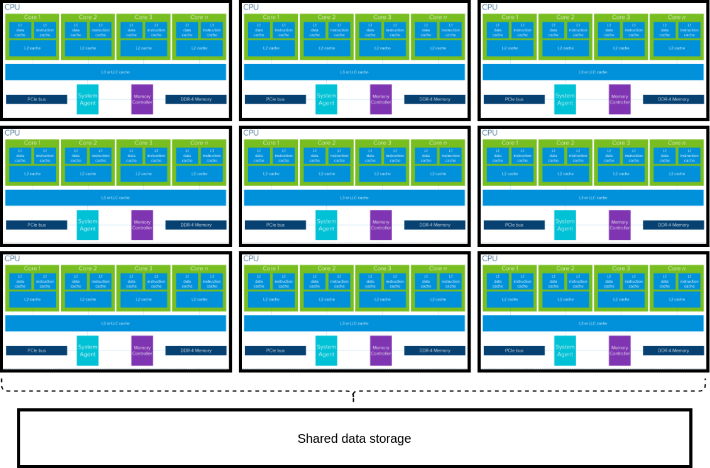

# Single Program Many Data (SPMD)
  This repository is meant to exemplify many incarnations of the SPMD parallelization paradigm; from multi-node Monte-Carlo to multi-threaded for loops. Common pitfalls are discussed and exampled, and templates created for ease of application. The goal of the repository is to familiarize a student with the SPMD technique, and enable them to acknowledge when an application is a good fit - being aware of failure mechanisms and general break-even costs.

|  |
|:--:|
| A sketch of a single compute job distributing over multiple nodes, each with multiple CPUs onboard. We emphasize that while inter-cpu communication on a single node is much faster than inter-node communication, there are more failure modes. For schematic latency numbers, see [latency numbers](https://gist.github.com/jboner/2841832)|

## Single node architecture
|  |
|:--:|
| A view of what the internals of a CPU node might look like, taken from *https://core.vmware.com/resource/exploring-gpu-architecture*. Note the shared memory via LLC cache and RAM. |

## Multi-node
|  |
|:--:|
| Diagram illustrating each node is self-contained, and communicates via IO to (slower) shared memory far from the nodes. |

## Monte-Carlo over Neural Network Trainings
To illustrate SPMD at a few levels, we show how one could deploy Monte-Carlo (utilizing independence of computation nodes) to train a family of identical architecture (but independently initialized) neural networks, which are then trained utilizing parallelization at the node level.

