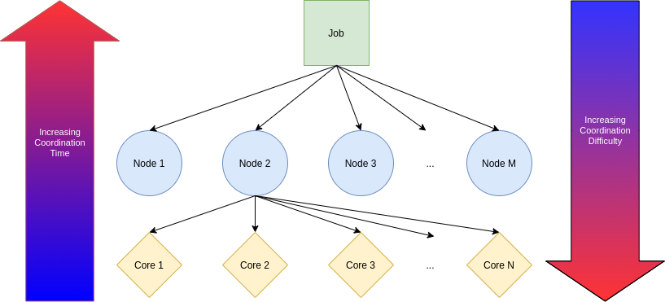

# Single Program Many Data (SPMD)
  This repository is meant to exemplify many incarnations of the SPMD parallelization paradigm; from multi-node Monte-Carlo to multi-threaded for loops. Common pitfalls are discussed and exampled, and templates created for ease of application. The goal of the repository is to familiarize a student with the SPMD technique, and enable them to acknowledge when an application is a good fit - being aware of failure mechanisms and general break-even costs.

